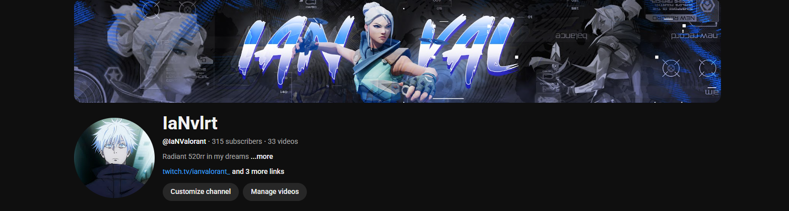
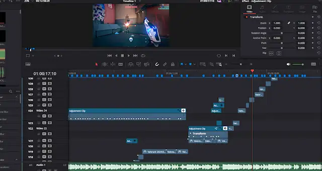
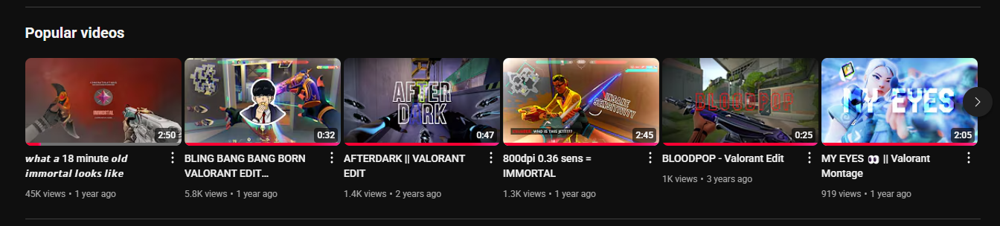

<!-- Portfolio Banner -->

<!-- Title and Welcome -->
<h1 align="center">👋 Hi, Welcome to my Portfolio</h1>
<h3 align="center">🚀 Aspiring Data Analyst / Data Scientist</h3>

✨ Currently improving my Python, Tableau and PowerBI skills. 
🎓 ICT Diploma student (Data Informatics Specialism), Year 2. 
🏫 Asia Pacific University of Technology & Innovation (APU). 
🙏 Seeking internship opportunities in Data Analytics or IT-related fields.

<!-- GitHub Snake Contribution Animation -->
<picture>
  <source media="(prefers-color-scheme: dark)" srcset="https://raw.githubusercontent.com/Ian-Chin/Ian-Chin/output/github-snake-dark.svg" />
  <source media="(prefers-color-scheme: light)" srcset="https://raw.githubusercontent.com/Ian-Chin/Ian-Chin/output/github-snake.svg" />
  
</picture>

<!-- Skills Section -->
<h2>💻 Languages and Tools I have placed my hands on</h2>

  
  
  
  
  
  
  
  
  
  
  
  
  
  

---

<!-- Video Editing Section -->

  
<strong>🎬 Extra Skill: Video Editing/Thumbnail Graphic Designs</strong>

   
    

  

  🎮 While playing at the highest competitive level in games, I realized I was pulling off some insane plays that deserved to be remembered. Since I was already playing seriously, I figured why not clip my best moments and turn them into highlight videos?
  

    

  

  🎞️ That’s how I got into **video editing**. I started compiling my gameplay into montages and edits for YouTube, experimenting with timing, effects, sound sync, and sometimes the videos might go viral from 1k to 45k views. It began as a side skill but quickly became something I enjoyed and refined. Now, I use tools like **DaVinci Resolve** for video editing and **canva/pixlr** for thumbnails to bring energy and style to my content.
  

    

  

  📺 Feel free to check out my channel for some of the projects I’ve worked on!
  

---
