<!-- Portfolio Banner -->

  

<!-- Title and Welcome -->
<h1 align="center">Hi, Welcome to my Portfolio</h1>
<h3 align="center">BI Analyst &nbsp;·&nbsp; Software Engineer &nbsp;·&nbsp; AI Developer &nbsp;·&nbsp; Entrepreneur</h3>

Part-Time Business Intelligence Analyst 
Building <a href="https://iunami.com">Iunami Agentics</a> — B2B/B2C AI SaaS 
Bachelor of Computer Science (Artificial Intelligence), Year 2 
Asia Pacific University of Technology &amp; Innovation (APU)

  
  
  

---

## In the Press

<table>
<tr>
<td width="34%">
  
</td>
<td width="66%">
  <b><a href="https://www.thestar.com.my/news/education/2025/06/29/double-gold-for-apu-diploma-team">Double gold for APU diploma team</a></b> 
  <b>The Star</b> &middot; 29 June 2025  
  Four APU diploma students swept both the Gold Award and the Best of Gold Award at the Edu@Innovate 2025 International Education Innovation Competition, held at Universiti Pendidikan Sultan Idris. Their entry, <i>Ravana Reimagined: Malaysia's Wayang Kulit Experience</i>, is an AI-powered chatbot that keeps Wayang Kulit alive through interactive storytelling and educational activities.
</td>
</tr>
<tr>
<td width="34%">
  
</td>
<td width="66%">
  <b><a href="https://cj.my/154490/apu-students-wins-double-gold-at-eduinnovate/">APU students wins double gold at Edu@Innovate</a></b> 
  <b>Citizens Journal Malaysia</b> &middot; 24 June 2025  
  A Diploma in ICT team from APU took home Gold and Best of Gold at Edu@Innovate 2025, outperforming Master's and PhD-level entries. <i>Ravana Reimagined</i> reimagines traditional Wayang Kulit as an AI chatbot with storytelling, quizzes, and a virtual museum built to pull young Malaysians back to the art form.
</td>
</tr>
<tr>
<td width="34%">
  
</td>
<td width="66%">
  <b><a href="https://www.apu.edu.my/news/apus-young-innovators-crowned-double-gold-eduinnovate-2025">APU's Young Innovators Crowned Double Gold at Edu@Innovate 2025</a></b> 
  <b>APU News</b> &middot; 18 June 2025  
  APU's own coverage of the win: four Diploma in Data Informatics students earned a Gold Award and the Best Gold Award at the International Education Innovation Competition for an AI-powered chatbot that preserves Malaysia's traditional shadow puppetry through interactive storytelling and a virtual museum.
</td>
</tr>
</table>

---

&nbsp;<b>Experience</b>

 

<table>
<tr>
<td width="30%" valign="top">
  <b>Daxonet Group</b> 
  Petaling Jaya, Selangor, Malaysia
</td>
<td width="70%" valign="top">
  <b>Business Intelligence Analyst</b> 
  Part-time &middot; Hybrid &middot; Jan 2026 &ndash; Present  
  Managing the Power BI projects &middot; Building and redesigning the responsive company website &middot; R&amp;D developer, testing AI tools, skills, MCPs and plugins.
</td>
</tr>
<tr>
<td width="30%" valign="top">
  <b>Daxonet Group</b> 
  Petaling Jaya, Selangor, Malaysia
</td>
<td width="70%" valign="top">
  <b>Internship Trainee &mdash; Data Analyst Intern</b> 
  Internship &middot; On-site &middot; Sep 2025 &ndash; Dec 2025  
  Developed and enhanced Power BI dashboards using Autocount SQL data &middot; Integrated dashboards into a mobile application with secure backend access &middot; Performed data validation and reporting on datasets exceeding 5M+ rows.
</td>
</tr>
<tr>
<td width="30%" valign="top">
  <b>Freelance</b> 
  Self-employed
</td>
<td width="70%" valign="top">
  <b>Freelance Video Editor</b> 
  Freelance &middot; Remote &middot; Jan 2017 &ndash; Jun 2026  
  Ian Chin | Video Content Strategist.
</td>
</tr>
</table>

---

<!-- CERTS:START -->

&nbsp;<b>Certifications &amp; Credentials</b>

 

<b>Awards</b>&nbsp;&nbsp;5

<table>
<tr>
<td align="center" width="25%"><b>Gold Award &mdash; Edu@Innovate 2025</b> Universiti Pendidikan Sultan Idris &middot; May 2025</td>
<td align="center" width="25%"><b>Best of Gold &mdash; Edu@Innovate 2025</b> Universiti Pendidikan Sultan Idris &middot; May 2025</td>
<td align="center" width="25%"><b>Edu@Innovate 2025 &mdash; Participation</b> Universiti Pendidikan Sultan Idris &middot; May 2025</td>
<td align="center" width="25%"><b>MyAI Future Hackathon &mdash; Finalist</b> GDG on Campus, UTM &middot; 2025</td>
</tr>
<tr>
<td align="center" width="25%"><a href="assets/certs/gold-award-eduinnovate-2025.jpg">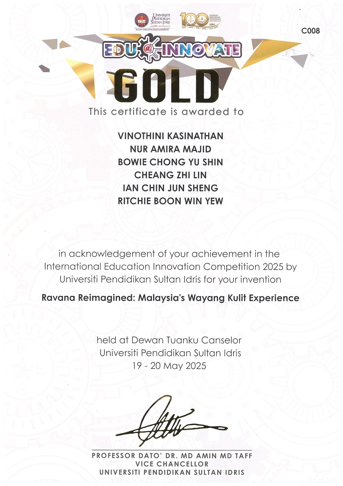</a></td>
<td align="center" width="25%"><a href="assets/certs/best-of-gold-eduinnovate-2025.jpg">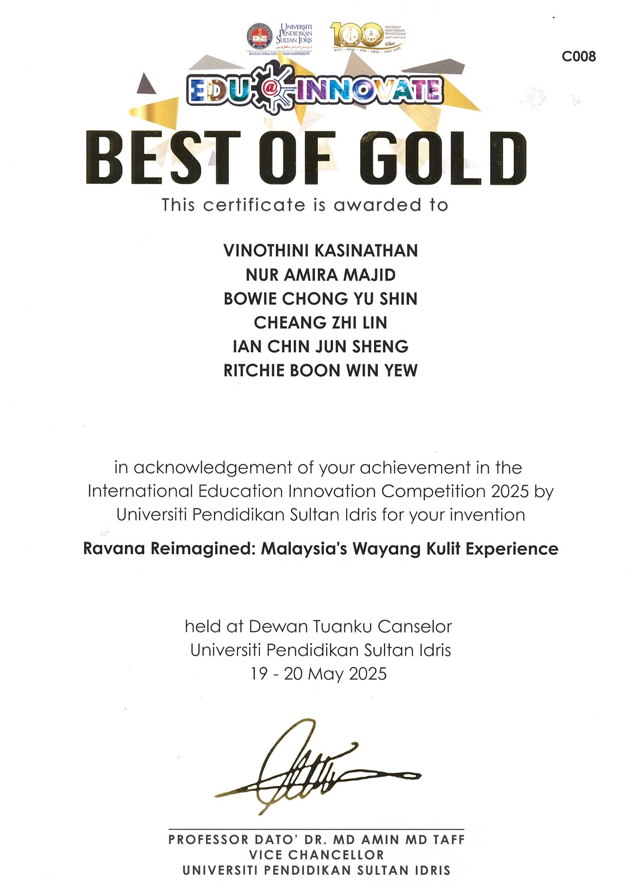</a></td>
<td align="center" width="25%"><a href="assets/certs/eduinnovate-2025-participation.jpg">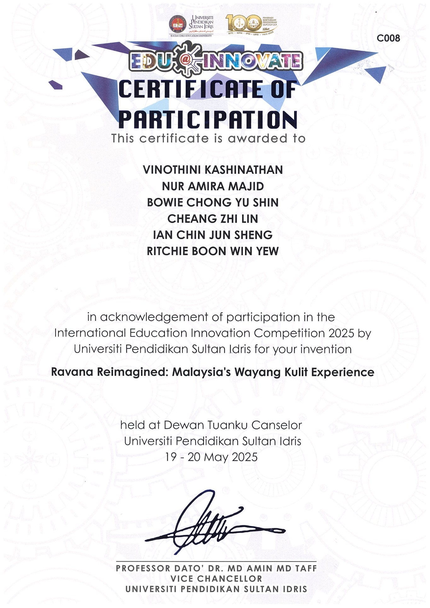</a></td>
<td align="center" width="25%"><a href="assets/certs/myai-future-hackathon-finalist.jpg">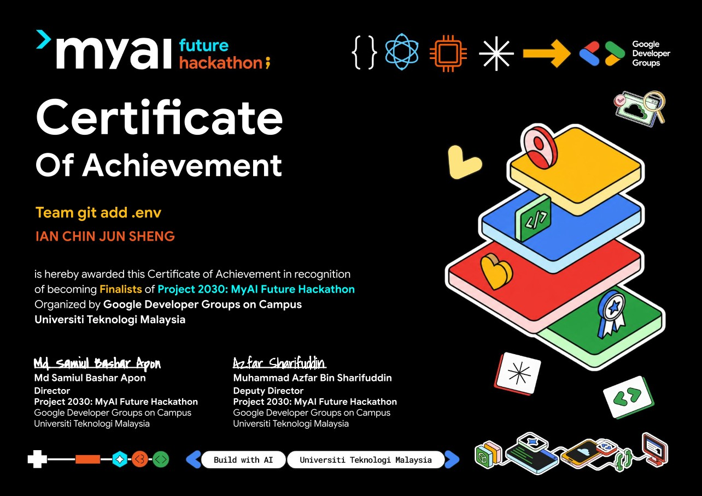</a></td>
</tr>
<tr>
<td align="center" width="25%"><b>MyAI Future Hackathon &mdash; Participation</b> GDG on Campus, UTM &middot; 2025</td>
</tr>
<tr>
<td align="center" width="25%"><a href="assets/certs/myai-future-hackathon-participation.jpg">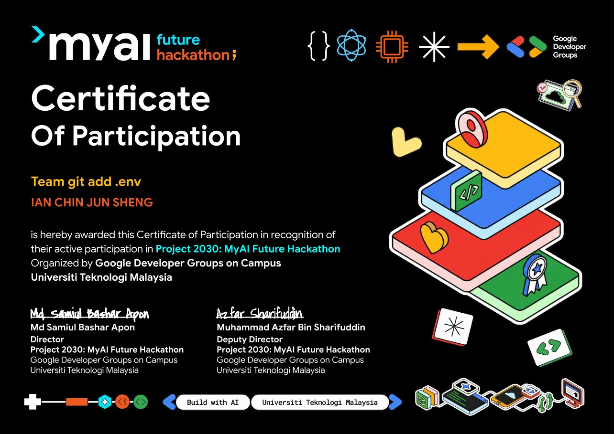</a></td>
</tr>
</table>

<b>Certifications</b>&nbsp;&nbsp;33

<table>
<tr>
<td align="center" width="25%"><b>What Is Generative AI?</b> LinkedIn Learning &middot; Aug 2026</td>
<td align="center" width="25%"><b>Practical GitHub Actions</b> LinkedIn Learning &middot; Aug 2026</td>
<td align="center" width="25%"><b>Introduction to Model Context Protocol</b> Claude Academy &middot; Anthropic &middot; Aug 2026</td>
<td align="center" width="25%"><b>AI Fluency for Students</b> Claude Academy &middot; Anthropic &middot; Aug 2026</td>
</tr>
<tr>
<td align="center" width="25%"><a href="assets/certs/what-is-generative-ai.jpg">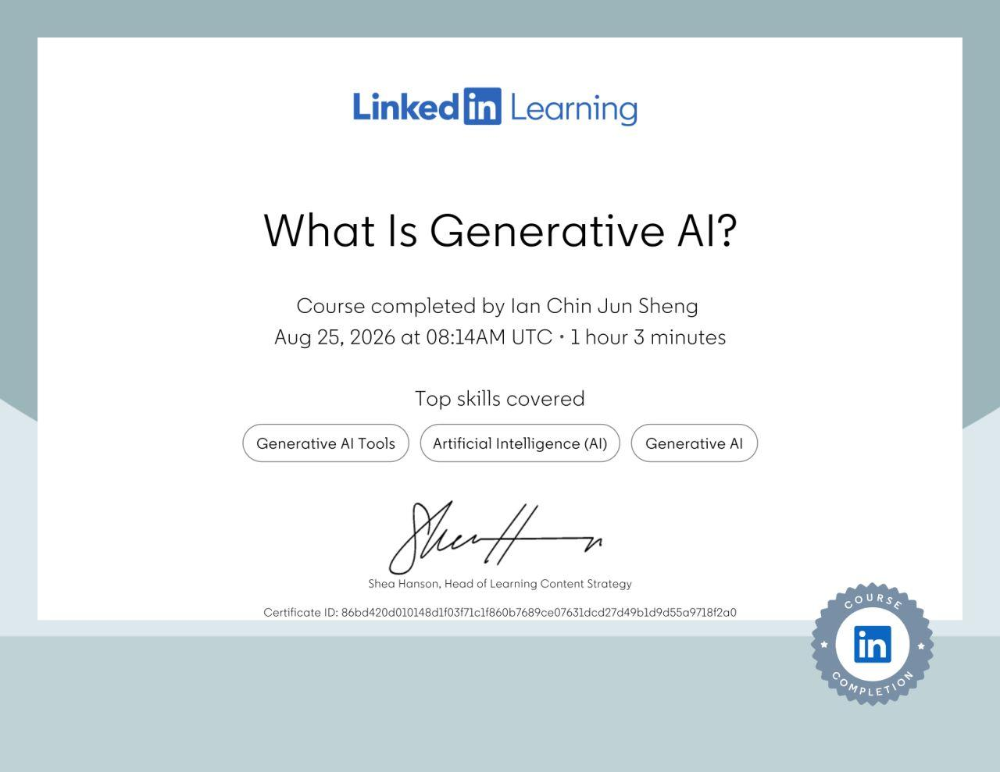</a></td>
<td align="center" width="25%"><a href="assets/certs/practical-github-actions.jpg">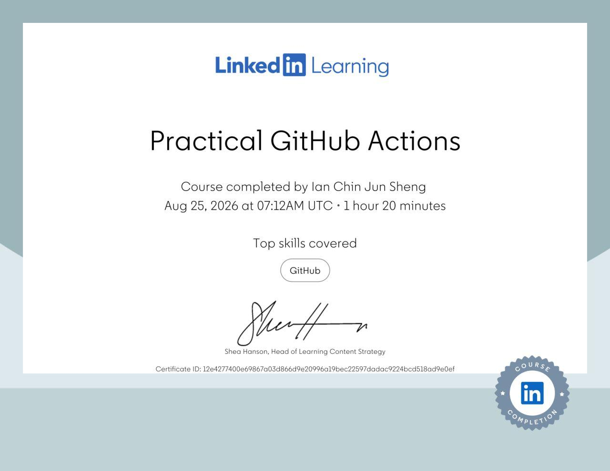</a></td>
<td align="center" width="25%"><a href="assets/certs/intro-model-context-protocol.jpg">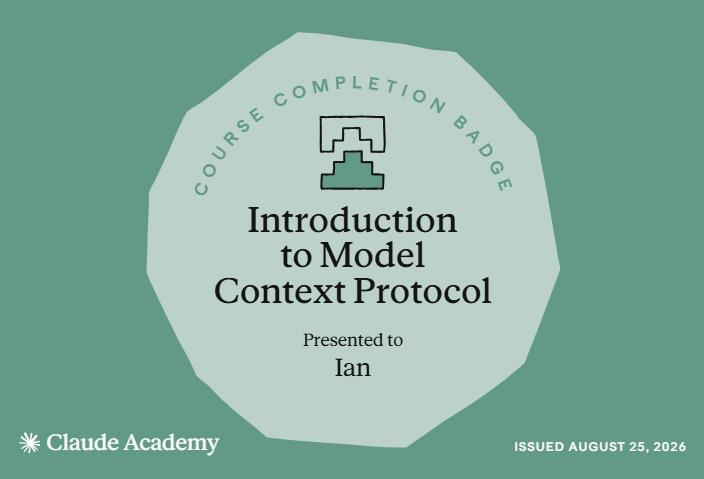</a></td>
<td align="center" width="25%"><a href="assets/certs/ai-fluency-for-students.jpg">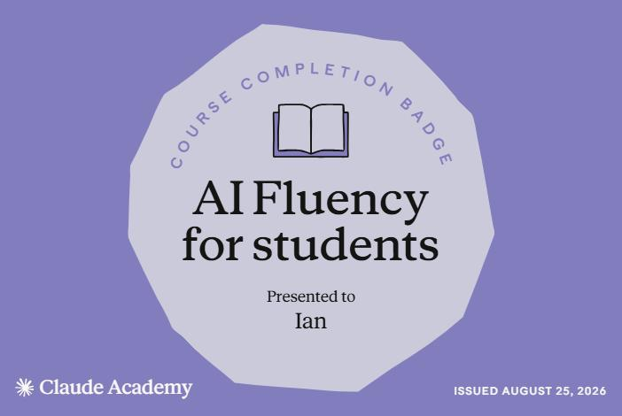</a></td>
</tr>
<tr>
<td align="center" width="25%"><b>AI Fluency: Framework &amp; Foundations</b> Claude Academy &middot; Anthropic &middot; Aug 2026</td>
</tr>
<tr>
<td align="center" width="25%"><a href="assets/certs/ai-fluency-framework-foundations.jpg">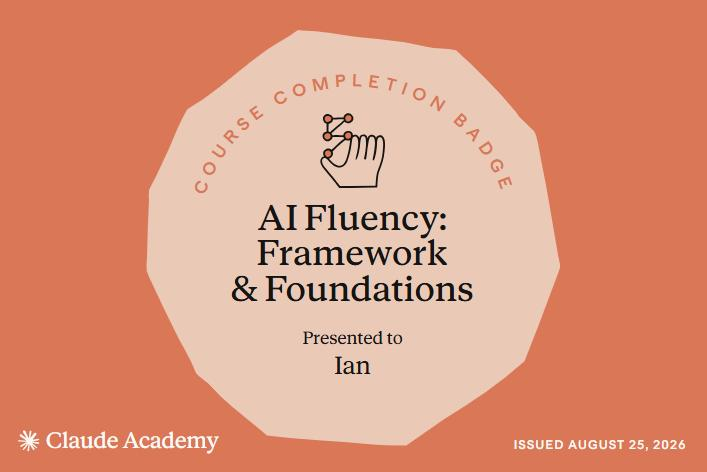</a></td>
</tr>
<tr>
<td align="center" width="25%"><b>Artificial Intelligence Fundamentals</b> IBM SkillsBuild &middot; Aug 2026</td>
<td align="center" width="25%"><b>Claude Code in Action</b> Anthropic &middot; May 2026</td>
<td align="center" width="25%"><b>Claude Code 101</b> Anthropic &middot; May 2026</td>
<td align="center" width="25%"><b>Claude 101</b> Anthropic &middot; May 2026</td>
</tr>
<tr>
<td align="center" width="25%"><a href="assets/certs/artificial-intelligence-fundamentals.jpg">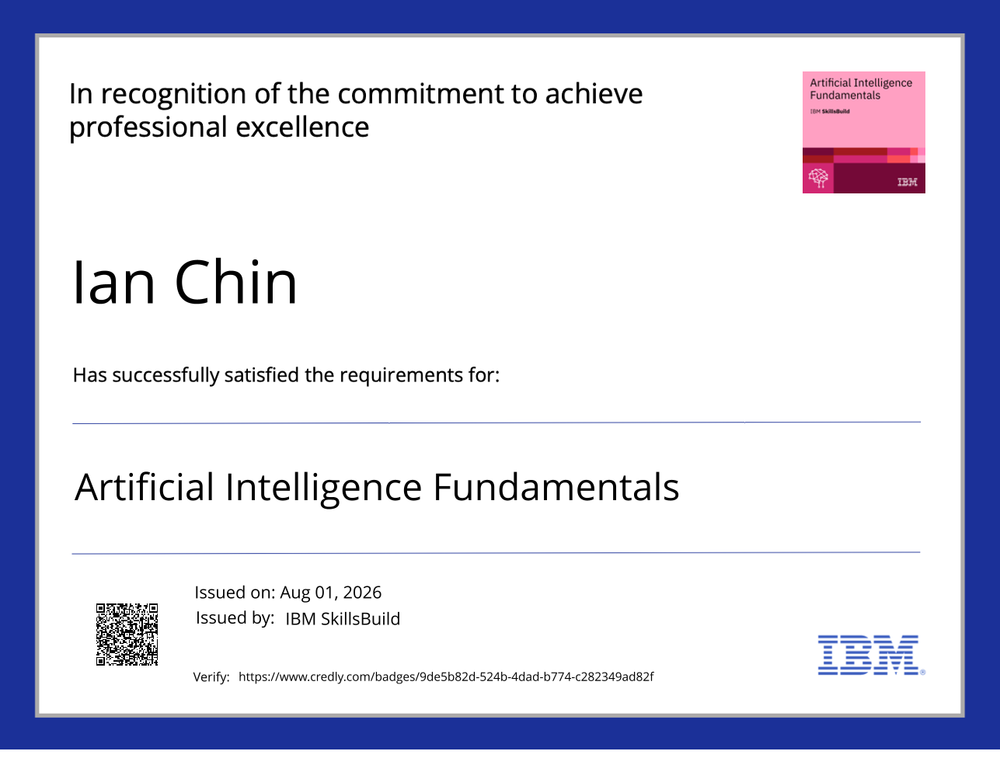</a></td>
<td align="center" width="25%"><a href="assets/certs/claude-code-in-action.jpg">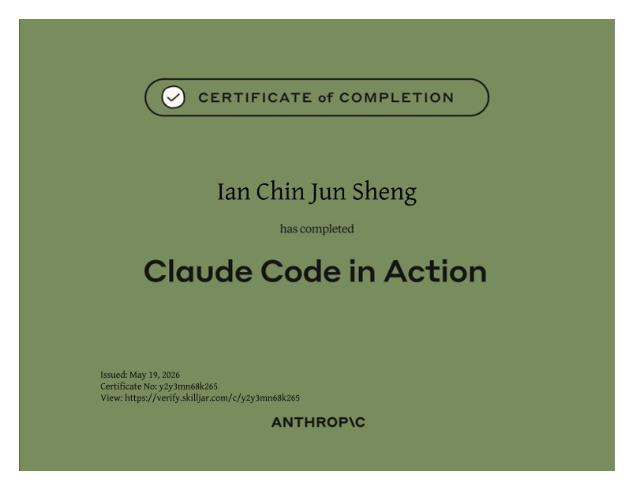</a></td>
<td align="center" width="25%"><a href="assets/certs/claude-code-101.jpg">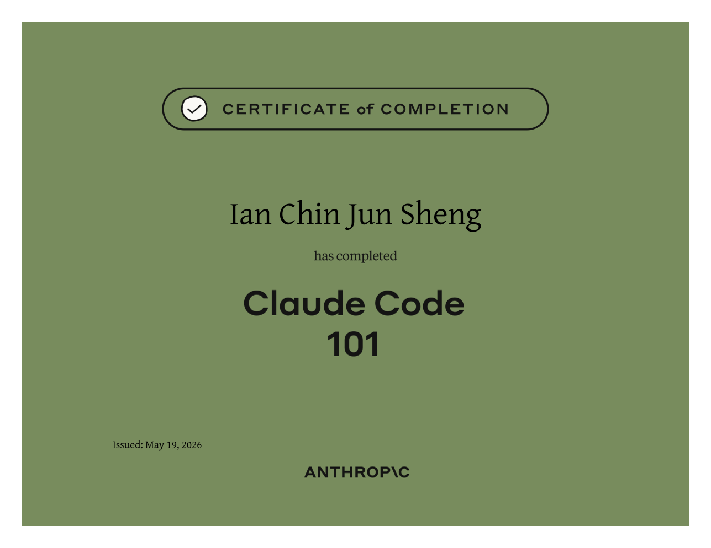</a></td>
<td align="center" width="25%"><a href="assets/certs/claude-101.jpg">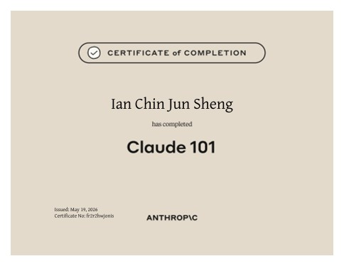</a></td>
</tr>
<tr>
<td align="center" width="25%"><b>Introduction to Claude Cowork</b> Anthropic &middot; May 2026</td>
<td align="center" width="25%"><b>Prompt Engineering Applications</b> Simplilearn SkillUp &middot; Sep 2025</td>
<td align="center" width="25%"><b>Prompt Engineering with GitHub Copilot</b> Microsoft &middot; Simplilearn &middot; Sep 2025</td>
<td align="center" width="25%"><b>Introduction to Copilot for Startups</b> Microsoft &middot; Simplilearn &middot; Sep 2025</td>
</tr>
<tr>
<td align="center" width="25%"><a href="assets/certs/introduction-to-claude-cowork.jpg">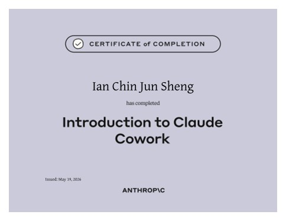</a></td>
<td align="center" width="25%"></td>
<td align="center" width="25%"><a href="assets/certs/prompt-engineering-github-copilot.jpg">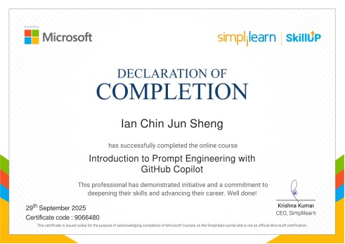</a></td>
<td align="center" width="25%"><a href="assets/certs/introduction-to-copilot-for-startups.jpg">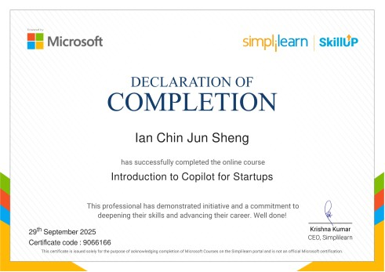</a></td>
</tr>
<tr>
<td align="center" width="25%"><b>Red Hat System Administration II (RH134)</b> Red Hat &middot; 40 hrs &middot; Jul 2026</td>
<td align="center" width="25%"><b>Red Hat System Administration I (RH124)</b> Red Hat &middot; 40 hrs &middot; May 2026</td>
<td align="center" width="25%"><b>Introduction to Data Analytics</b> Simplilearn SkillUp &middot; Apr 2025</td>
<td align="center" width="25%"><b>SQL for Data Analysis</b> Simplilearn SkillUp &middot; Apr 2025</td>
</tr>
<tr>
<td align="center" width="25%"><a href="assets/certs/red-hat-rh134.jpg">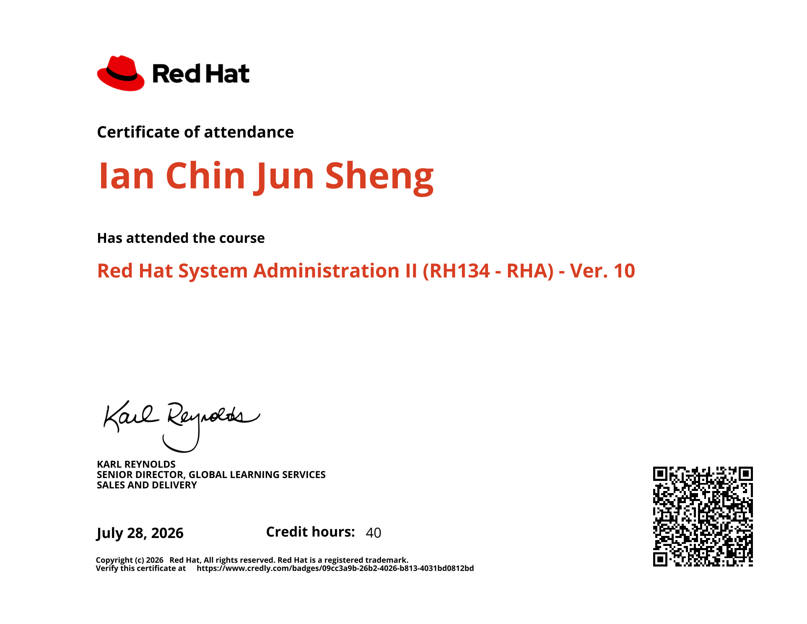</a></td>
<td align="center" width="25%"></td>
<td align="center" width="25%"><a href="assets/certs/introduction-to-data-analytics.jpg">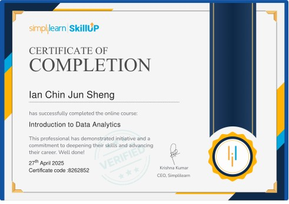</a></td>
<td align="center" width="25%"></td>
</tr>
<tr>
<td align="center" width="25%"><b>Power BI Data Modelling Basics</b> Simplilearn SkillUp &middot; May 2025</td>
<td align="center" width="25%"><b>Business Analytics with Excel</b> Simplilearn SkillUp &middot; May 2025</td>
<td align="center" width="25%"><b>Introduction to MS Excel</b> Simplilearn SkillUp &middot; May 2025</td>
<td align="center" width="25%"><b>Introduction to SEO</b> Simplilearn SkillUp &middot; Dec 2025</td>
</tr>
<tr>
<td align="center" width="25%"></td>
<td align="center" width="25%"><a href="assets/certs/business-analytics-with-excel.jpg">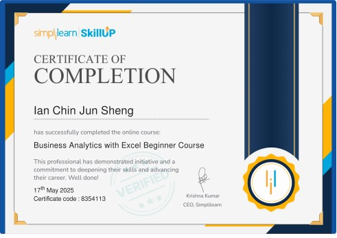</a></td>
<td align="center" width="25%"><a href="assets/certs/introduction-to-ms-excel.jpg">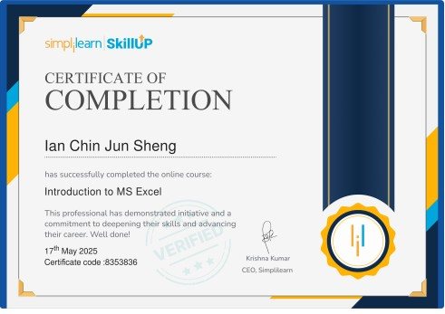</a></td>
<td align="center" width="25%"><a href="assets/certs/introduction-to-seo.jpg">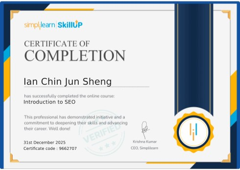</a></td>
</tr>
<tr>
<td align="center" width="25%"><b>Python</b> Kaggle &middot; Jun 2025</td>
<td align="center" width="25%"><b>Python Coder</b> Kaggle</td>
<td align="center" width="25%"><b>Dataset Creator</b> Kaggle</td>
<td align="center" width="25%"><b>Github Coder</b> Kaggle</td>
</tr>
<tr>
<td align="center" width="25%"><a href="assets/certs/kaggle-python.jpg">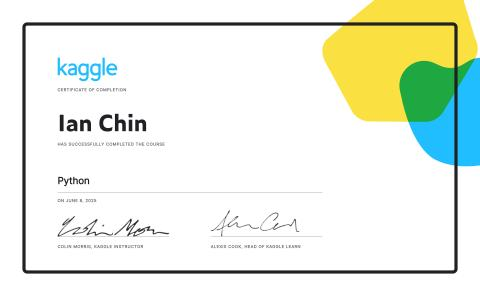</a></td>
<td align="center" width="25%"><a href="assets/certs/kaggle-python-coder.jpg">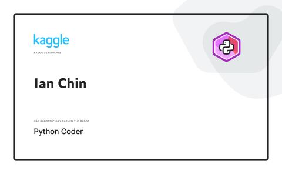</a></td>
<td align="center" width="25%"><a href="assets/certs/kaggle-dataset-creator.jpg">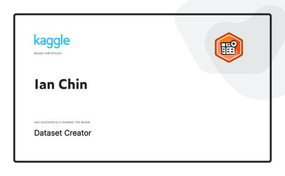</a></td>
<td align="center" width="25%"><a href="assets/certs/kaggle-github-coder.jpg">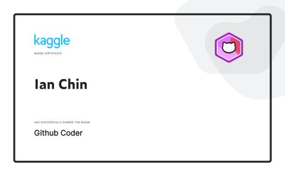</a></td>
</tr>
<tr>
<td align="center" width="25%"><b>Learner</b> Kaggle</td>
<td align="center" width="25%"><b>Linked Dataset Creator</b> Kaggle</td>
<td align="center" width="25%"><b>Code Forker</b> Kaggle</td>
<td align="center" width="25%"><b>Code Tagger</b> Kaggle</td>
</tr>
<tr>
<td align="center" width="25%"><a href="assets/certs/kaggle-learner.jpg">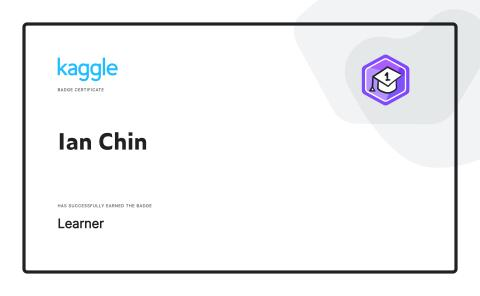</a></td>
<td align="center" width="25%"><a href="assets/certs/kaggle-linked-dataset-creator.jpg">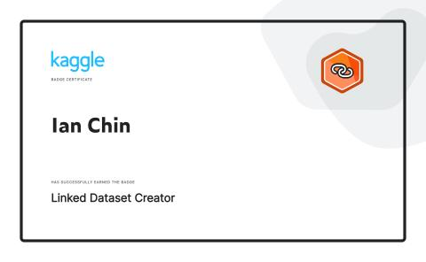</a></td>
<td align="center" width="25%"><a href="assets/certs/kaggle-code-forker.jpg">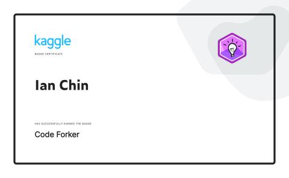</a></td>
<td align="center" width="25%"></td>
</tr>
<tr>
<td align="center" width="25%"><b>Bookmarker</b> Kaggle</td>
<td align="center" width="25%"><b>Agent of Discord</b> Kaggle</td>
<td align="center" width="25%"><b>Vampire</b> Kaggle</td>
<td align="center" width="25%"><b>Stylish</b> Kaggle</td>
</tr>
<tr>
<td align="center" width="25%"><a href="assets/certs/kaggle-bookmarker.jpg">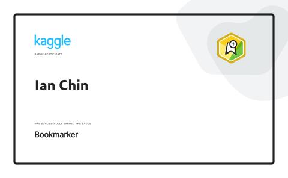</a></td>
<td align="center" width="25%"><a href="assets/certs/kaggle-agent-of-discord.jpg">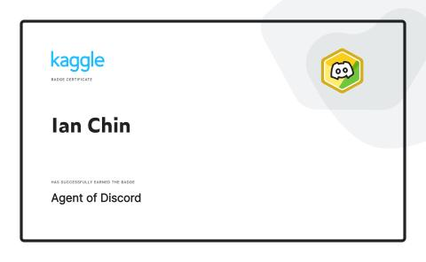</a></td>
<td align="center" width="25%"></td>
<td align="center" width="25%"><a href="assets/certs/kaggle-stylish.jpg">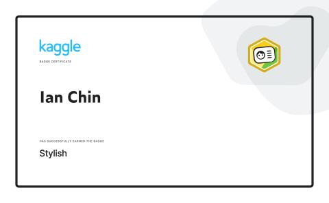</a></td>
</tr>
</table>

Click any thumbnail to open it full size.

<!-- CERTS:END -->

---

## Languages and Tools I have placed my hands on

  
  
  
  
  
  
  
  
  
  
  
  
  
  
  
  
  
  
  
  
  
  
  
  
  
  
  
  
  
  
  
  
  
  
  
  
  
  
  
  
  
  
  
  
  
  
  
  
  
  

<!-- Proudly created with GPRM ( https://gprm.itsvg.in ) -->

---

## Spoken Languages

<table>
<tr>
<td align="center" width="25%"><b>Chinese</b> Native or bilingual proficiency</td>
<td align="center" width="25%"><b>English</b> Native or bilingual proficiency</td>
<td align="center" width="25%"><b>Cantonese</b> Professional working proficiency</td>
<td align="center" width="25%"><b>Malay</b> Elementary proficiency</td>
</tr>
</table>

---

<!-- Activity graph. If it stops rendering, the host is down: swap activity-graph.vercel.app
     for github-activity-graph.vercel.app or readme-activity-graph.vercel.app (same project).
     The original github-readme-activity-graph.vercel.app is dead (402 DEPLOYMENT_DISABLED). -->
<picture>
  <source media="(prefers-color-scheme: dark)" srcset="https://activity-graph.vercel.app/graph?username=Ian-Chin&bg_color=00000000&color=C9D1D9&line=FF003C&point=FF4D6D&area=true&area_color=4A0404&title_color=FF003C&hide_border=true&radius=16&height=250&custom_title=Code%20%7C%20Build%20%7C%20Ship" />
  <source media="(prefers-color-scheme: light)" srcset="https://activity-graph.vercel.app/graph?username=Ian-Chin&bg_color=00000000&color=24292F&line=FF003C&point=FF4D6D&area=true&area_color=FFC9CE&title_color=FF003C&hide_border=true&radius=16&height=250&custom_title=Code%20%7C%20Build%20%7C%20Ship" />
  
</picture>

<table>
<tr>
<td width="33%">

<picture>
  <source media="(prefers-color-scheme: dark)" srcset="https://github-readme-stats.shion.dev/api/top-langs/?username=Ian-Chin&theme=dark&hide_border=true&bg_color=00000000&title_color=FF003C&layout=compact&langs_count=8" />
  <source media="(prefers-color-scheme: light)" srcset="https://github-readme-stats.shion.dev/api/top-langs/?username=Ian-Chin&theme=default&hide_border=true&bg_color=00000000&title_color=FF003C&layout=compact&langs_count=8" />
  
</picture>

</td>
<td width="33%">

<picture>
  <source media="(prefers-color-scheme: dark)" srcset="https://github-profile-summary-cards.vercel.app/api/cards/repos-per-language?username=Ian-Chin&theme=transparent" />
  <source media="(prefers-color-scheme: light)" srcset="https://github-profile-summary-cards.vercel.app/api/cards/repos-per-language?username=Ian-Chin&theme=transparent" />
  
</picture>

</td>
<td width="34%">

<picture>
  <source media="(prefers-color-scheme: dark)" srcset="https://github-profile-summary-cards.vercel.app/api/cards/most-commit-language?username=Ian-Chin&theme=transparent" />
  <source media="(prefers-color-scheme: light)" srcset="https://github-profile-summary-cards.vercel.app/api/cards/most-commit-language?username=Ian-Chin&theme=transparent" />
  
</picture>

</td>
</tr>
</table>

<!-- GitHub Snake Contribution Animation -->

<picture>
  <source media="(prefers-color-scheme: dark)" srcset="https://raw.githubusercontent.com/Ian-Chin/Ian-Chin/output/github-snake-dark.svg" />
  <source media="(prefers-color-scheme: light)" srcset="https://raw.githubusercontent.com/Ian-Chin/Ian-Chin/output/github-snake.svg" />
  
</picture>

---

  <i>“I’ll see you at the top because the bottom is too crowded. 
  But we never look down on anybody unless we’re willing to help them up.”</i> 
  — Zig Ziglar

---

  <i>⭐ Star my repositories if you find them interesting!</i> 
  <i>🤝 Open to collaborations and learning opportunities</i>

